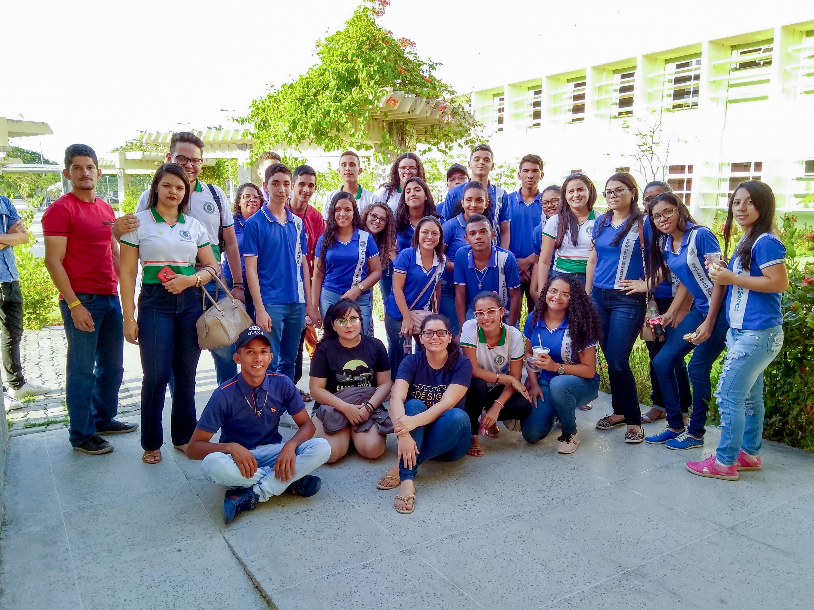

## ©recepcoes ð2019-10-25 Recepção da escola Alfredo Machado
###

No ontem, dia 25 de outubro de 2019, nós recebemos a Escola de Ensino Médio Alfredo Machado da cidade de Madalena, os 30 alunos que estão no 3º ano conheceram um pouco sobre os nossos cursos, bolsas, auxílios em um bate-papo bem descontraído, com participação ativa dos alunos, onde eles tiveram a oportunidade de sanar todas as suas dúvidas em relação a esse novo tempo que irá iniciar na vida deles.

Realizamos a dinâmica "Conhecendo o Campus" cujo objetivo é que eles divididos em grupos procurem e conheçam pontos importantes como o Restaurante Universidade, Secretaria Académica, Biblioteca, entre outros.

Os alunos adoraram a visita e se animaram com a possibilidade de estudar na UFC Campus Quixadá.
Gostaríamos de agradecer a EEM Alfredo Machado pela visita.

Quer visitar nossa instituição? Conhecer nossos curso? Entra em contato com a gente! 
